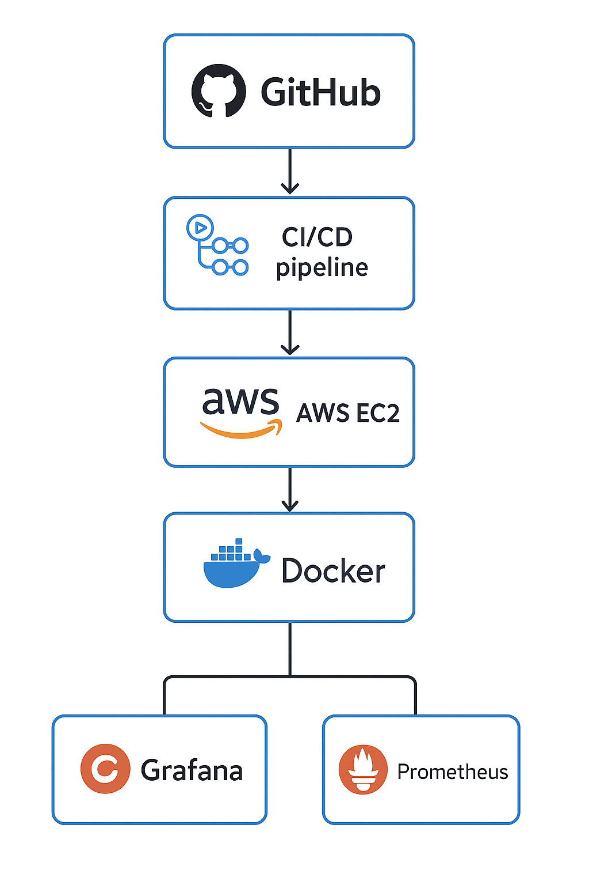

Launching AWS EC2 via Bash, Dockerized CI/CD with GitHub Actions and Grafana Monitoring.

This project automates the process of launching an EC2 instance on AWS using GitHub Actions. Whenever you push code to the main branch, a fresh server is created — complete with Docker, Nginx, Grafana, Prometheus, and Node Exporter. You can monitor with Grafana.

✅ What This Project Does

✔ Automatically launches an EC2 instance when code is pushed to GitHub

✔ Installs Docker and deploys:

Nginx (on port 80)

Grafana (on port 3000)

Prometheus (on port 9090)

Node Exporter (on port 9100 for system metrics)

✔ Sets up monitoring using Grafana dashboards

How the Workflow Works

🔹 1. You push code to GitHub (main branch)

➡ GitHub Actions starts automatically

➡ AWS credentials from GitHub Secrets are used

➡ Launch_Instance.sh runs and:

Creates an EC2 instance

Installs Docker

Deploys Nginx, Grafana, Prometheus, Node Exporter

🔹 2. Access the tools in your browser

Service	URL Example

Nginx	http://<EC2-Public-IP>

Grafana	http://<EC2-Public-IP>:3000

Prometheus	http://<EC2-Public-IP>:9090

Node Exporter	http://<EC2-Public-IP>:9100/metrics

📊 Grafana Monitoring Flow

Node Exporter collects CPU, RAM, Disk, Network data

Prometheus stores these metrics

Grafana reads data from Prometheus and displays dashboards

